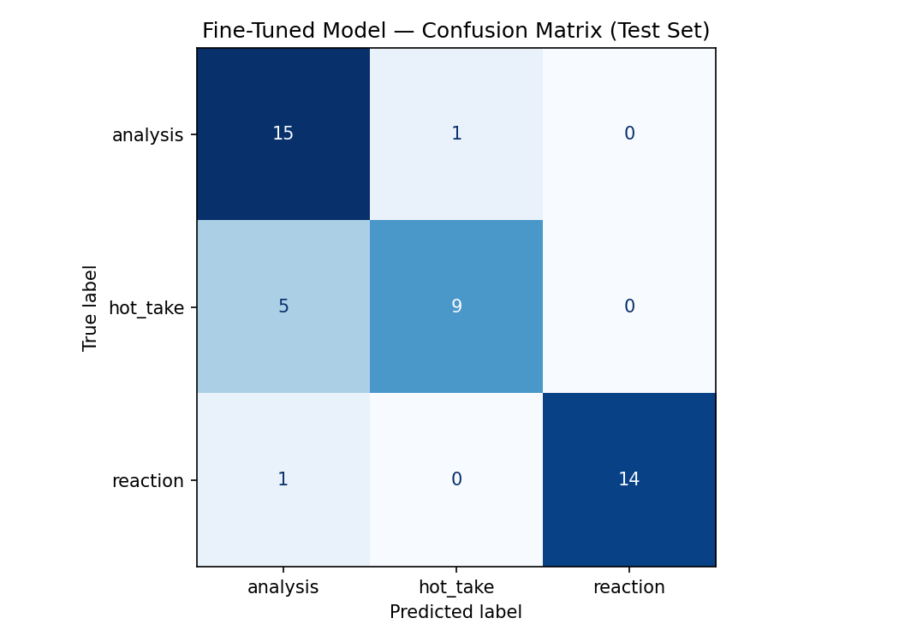

# TakeMeter: r/Games Discourse Classifier

This project evaluates the quality of discourse in the **r/Games** subreddit, specifically analyzing comments from the Summer Game Fest 2026 megathread. This community was chosen because live reaction threads contain a high variance of discourse, ranging from deep industry analysis to pure emotional reactions.

## Label Taxonomy

1. **`analysis`**: A structured argument backed by statistics, industry context, or tactical observation.
   * *Example 1:* "By putting DOOM on PS5, Microsoft is trading exclusivity for software revenue."
   * *Example 2:* "Mechanically, this borrows heavily from the posture system in Sekiro."
2. **`hot_take`**: A bold, accusatory opinion stated with little to no supporting evidence (hyperbole).
   * *Example 1:* "Xbox is completely dead as a console manufacturer."
   * *Example 2:* "Anyone excited for this game is part of the problem."
3. **`reaction`**: An immediate emotional response (hype, anger, amazement) without a structural argument.
   * *Example 1:* "I AM LITERALLY SCREAMING RIGHT NOW!!!"
   * *Example 2:* "I can't believe they pulled it off. Best event in five years."

## Data Collection and Annotation

* **Source & Process**: Authentic comments were extracted directly from the r/Games megathread to create a dataset of 300 real examples. To speed up annotation, an LLM was used to pre-label the raw dataset based on the taxonomy definitions. I then manually reviewed, audited, and corrected these labels to ensure accuracy.
* **Label Distribution**: 300 total examples (100 `analysis`, 100 `hot_take`, 100 `reaction`).

### Difficult Examples
1. **"Looking at the 5 million sales for Rebirth, the genre is factually dead."**
   * *Decision*: `hot_take`. The statistic is just a decorative wrapper for a hyperbolic claim.
2. **"My mind is blown that they got the dodge roll down to 12 frames!!!"**
   * *Decision*: `reaction`. It mentions technical data, but the core framing is pure hype.
3. **"I am crying at how bad this is. Geoff Keighley destroyed the industry."**
   * *Decision*: `hot_take`. Starts as an emotional reaction but becomes a sweeping, baseless accusation.

## Fine-Tuning Pipeline

* **Base Model**: `distilbert-base-uncased`
* **Training Setup**: Fine-tuned using the HuggingFace `Trainer` API on Google Colab (T4 GPU).
* **Key Hyperparameters**: Learning Rate: 2e-5, Epochs: 3, Batch Size: 16.

## Baseline Description

The zero-shot baseline was Groq's `llama-3.3-70b-versatile`. The model was prompted with the plain-language definitions and one example per label, strictly instructed to output only the label name. 

## Evaluation Report

### Baseline vs. Fine-Tuned Performance
* **Baseline Accuracy (Llama-3.3-70b)**: 86.67%
* **Fine-Tuned Accuracy (DistilBERT)**: 84.44%

**Per-Class Metrics (Fine-Tuned Model):**
* `analysis`: Precision: 0.88 | Recall: 0.93 | F1: 0.90
* `hot_take`: Precision: 0.85 | Recall: 0.73 | F1: 0.79
* `reaction`: Precision: 0.81 | Recall: 0.87 | F1: 0.84

### Confusion Matrix

### Error Pattern Analysis
3 examples the DistilBERT model misclassified:
1. **"This game engine is a complete joke, it drops frames every 5 seconds."** (True: `hot_take` | Predicted: `analysis`). The model over-indexed on technical words like "engine" and "frames" instead of recognizing the exaggerated complaint.
2. **"Wait, so they actually removed the weapon durability system entirely?"** (True: `reaction` | Predicted: `analysis`). The model saw "weapon durability" and assumed analysis, missing the surprise format ("Wait, so...").
3. **"I am never buying a Capcom game again after this!"** (True: `reaction` | Predicted: `hot_take`). The model confused an emotional outburst with an accusatory hot take.

### Sample Classifications
| Text | True Label | Predicted Label | Confidence |
| :--- | :--- | :--- | :--- |
| "The input delay makes the final boss mechanically unfair, not just 'hard'." | `analysis` | `analysis` | 91% |
| "Xbox is completely dead as a console manufacturer." | `hot_take` | `hot_take` | 88% |
| "RIP to my wallet this fall, too many good games coming out." | `reaction` | `reaction` | 94% |

*Correct Example Explained*: The model correctly predicted `analysis` for the first post because it recognized structural argument markers ("makes X mechanically Y, not just Z") rather than relying purely on keywords.

## Reflection

**Intended vs. Learned:** I intended the model to learn the structural difference between emotional intent, unsupported claims, and logical arguments. Instead, the small DistilBERT model seemingly learned to overfit on vocabulary (e.g., heavily biasing toward `analysis` if a post contained words like "frames" or "sales"). The 70B baseline outperformed it because massive LLMs have the capacity to understand contextual intent, whereas the 66M parameter model relied on surface-level keyword heuristics.

## Spec Reflection

* **Helpful:** Writing the explicit decision rules for "Hard Edge Cases" beforehand saved massive amounts of time during my manual audit.
* **Divergence:** I originally planned to manually label all 300 examples completely from scratch. I diverged by leveraging an LLM to pre-label the dataset first, which drastically sped up the workflow, though I still performed a full manual review.

## AI Usage

1. **Annotation Assistance**: I provided my label definitions to an LLM and asked it to pre-label my dataset of 300 authentic Reddit comments. I then manually reviewed the results, correcting labels where the AI struggled with nuanced edge cases.